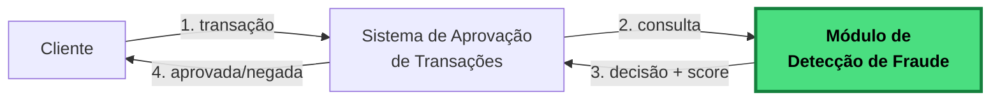
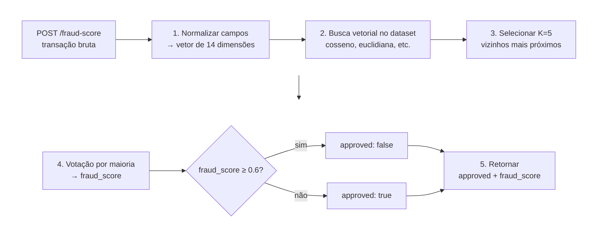

# Rinha de Backend 2026 – Detecção de Fraude por Busca Vetorial!

## Sobre esta Edição

Nesta edição, você vai construir uma **API de detecção de fraude em transações financeiras**. A cada requisição de autorização, sua API recebe os dados de uma transação e precisa responder se ela deve ser **aprovada** ou **negada**, junto com um *fraud score* entre `0.0` e `1.0`.

A detecção da fraude é feita por **busca vetorial**: a transação é transformada em um vetor de 14 dimensões e comparada a um dataset de referência com 100 mil transações já classificadas como fraude ou legítimas. As `N` referências mais parecidas "votam" — se a maioria for fraude, a nova transação também é classificada como fraude.



O módulo destacado em verde é **o que você vai construir**.


## O Básico do Desafio



1. A API recebe um `POST /fraud-score` com os dados da transação.
1. Normaliza os campos em um vetor de 14 dimensões (valores entre `0.0` e `1.0`).
1. Faz uma **busca vetorial** contra o dataset de referência — pode ser por distância de cosseno, euclidiana ou **qualquer outra métrica de distância** que você preferir.
1. Pega os `K=5` vizinhos mais próximos e faz votação por maioria.
1. Retorna `{ approved, fraud_score }`, por exemplo:
   ```json
   { "approved": false, "fraud_score": 0.8 }
   ```

**A infraestrutura** é o setup clássico da Rinha: duas ou mais instâncias da API atrás de um load balancer com limite de CPU e memória (1.0 CPU e 350MB de memória no total).

---

## Trilha de Leitura

Leia nesta ordem (ou pule direto para o que te interessa):

1. **[BUSCA_VETORIAL.md](./BUSCA_VETORIAL.md)** — O que é busca vetorial, normalização e KNN, com exemplo passo-a-passo.
   *Essencial se você nunca trabalhou com vetores ou KNN.*

2. **[DATASET.md](./DATASET.md)** — Formato dos arquivos de referência (`references.json`, `mcc_risk.json`, `normalization.json`) e as 14 dimensões do vetor.
   *Para entender como transformar o payload em vetor.*

3. **[API.md](./API.md)** — Contrato dos endpoints (`POST /fraud-score`, `GET /ready`), formato do payload e da resposta.
   *Essencial — é o que sua submissão precisa implementar.*

4. **[ARQUITETURA.md](./ARQUITETURA.md)** — Limites de CPU/memória, docker-compose, nginx, portas, stateless.
   *Antes de montar o container de submissão.*

5. **[AVALIACAO.md](./AVALIACAO.md)** — Fórmula de pontuação, peso de FP/FN, multiplicador de latência, como rodar o teste local.
   *Para otimizar sua pontuação.*

6. **[SUBMISSAO.md](./SUBMISSAO.md)** — Passo-a-passo do PR, checklist e data limite.
   *Quando estiver pronto para submeter.*

7. **[FAQ.md](./FAQ.md)** — Dúvidas recorrentes, armadilhas comuns, o que pode e não pode.

---

Para o sumário geral, volte ao [README principal](../../README.md).
